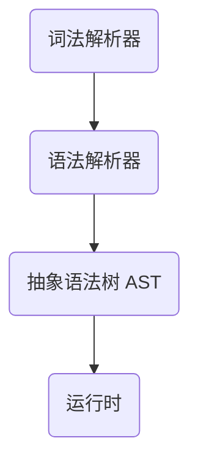

# 开始
## 需要做的准备
* 电脑上拥有 `Python3.x` 的运行环境
> 若要运行完整的项目，尤其是在 `Windows` 系统中，你同时需要安装 [`rust`](https://www.rust-lang.org/zh-CN/)
* 拥有 `Python3` 的编程基础，以及理解 `rust` 或 `shell script` 的能力
* 电脑上安装了 `git`，以更好的进行版本控制
* 可以流畅的使用 Github，否则，你需要将以下所有的 `github.com/iewnfod` 替换成 `gitee.com/ricky-tap`，同时在 Gitee 中提出的 issue 大概率不会被我注意到

## 体验项目
### macOS
* 在 [releases](https://github.com/iewnfod/CAIE_Code/releases) 中下载对安装包进行一键安装。
* 如果安装失败，可以参考 Linux 中的手动安装方案。

### Linux
1. 克隆此项目到本地
```shell
git clone https://github.com/iewnfod/CAIE_Code.git
```
2. 进入项目目录
```shell
cd CAIE_Code
```
3. 将 `bin` 目录添加到你的 `PATH` 中
```shell
export PATH=/absolute/path/to/bin:$PATH
```
4. 在命令行运行 `cpc` 来进行体验

### Windows
1. 克隆此项目到本地
```powershell
git clone https://github.com/iewnfod/CAIE_Code.git
```
2. 进入项目目录
```powershell
cd CAIE_Code
```
3. 在高级系统设置中，将项目中的 bin 目录的绝对路径添加到用户的 PATH 环境变量中
4. 在 PowerShell 中运行 `cpc` 来进行体验
5. 如果 bin 目录中的二进制文件无法在你的电脑上正常运行，你需要手动为你的平台编译启动文件，并将编译好的文件复制到 bin 中
```powershell
cargo build --release
```

### 运行结果
在成功启动之后，并安装完依赖之后，若出现类似于以下的输出，则说明安装成功：
```
CAIE Pseudocode Interpreter v0.1.4 (dev/de2b8b8)
Using [ PyPy 3.9.16 ] on Darwin
Repository at https://github.com/iewnfod/CAIE_Code/
Copyright (c) 2023 Iewnfod.
All Rights Reserved.
>
```

**代码样例**
```cpc
> DECLARE a : INTEGER
> a <- 1
> OUTPUT a + 1
2
```

## 了解一个解释器的基本结构

* 词法解析器 (Lexer)，可以把一个纯文本变为由多个 token 组成的数组，而不是一个个单独的字符。
* 语法接系统 (Parser)，可以读取每个 token 并尝试将它们拼接，以满足一定的语法。
* 抽象语法数 AST (Abstract Syntax Tree)，可以将拼接好的 token 进行处理，形成一个树状结构，准备好运行。
* 运行时，在一段纯文本成为语法树之后，我们可以遍历树上的每个节点并进行对应的操作，以实现程序整体的运行。
> 如果你想要编译你的语法，运行时应该替换为一个类似于翻译器的东西。将你的语法树翻译为二进制的机器代码。你也可以选择 `llvm` 或类似产品作为后端，来实现多平台支持。
> 如果你想要更高的运行速度，你需要在运行语法树的时候进行优化，但这个过程并不会影响到最终的运行结果，因此此项目并不包含优化部分。

## 运行案例
以下是一段简单的代码:
```
DECLARE a : INTEGER
a <- 1
OUTPUT a + 1
```

对于这段代码来说，通过词法分析，成为了以下有序的 token:
* `DECLARE`, `a`, `:`, `INTEGER`
* `a`, `<-`, `1`
* `OUTPUT`, `a`, `+`, `1`

接着，通过语法分析，可以发现，三行代码依次符合我们语言定义的以下三个语法:
* `DECLARE <id> : <type>`
* `<id> <- <expression>`
* `OUTPUT <expression>`

由此，我们可以产生与每个语法对应的AST节点，可以简单表示为以下模式:
```
VARIABLE a
| INTEGER
| False

ASSIGN
| GET a
| INTEGER 1

OUTPUT
| OUTPUT_EXPRESSION
| | PLUS
| | | GET a
| | | INTEGER 1
```

> 如果你想要在体验时也有类似的输出，可以使用 `cpc -gt` 来运行

最终，我们可以遍历这棵生成的AST，运行每个节点并产生输出 `2`
