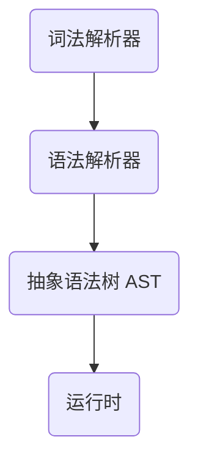

# 开始
## 需要做的准备
* 电脑上拥有 `Python3.x` 的运行环境
> 若要运行完整的项目，尤其是在 `Windows` 系统中，你同时需要安装 `rust`
* 拥有 `Python3` 的编程基础，以及理解 `rust` 或 `shell script` 的能力
* 电脑上安装了 `git`，以更好的版本控制
* 可以流畅的使用 Github，否则，你需要将以下所有的 `github.com/iewnfod` 替换成 `gitee.com/ricky-tap`，同时在 Gitee 中提出的 issue 大概率不会被我注意到

## 体验项目
* 如果你使用的是 `macOS`，你可以直接在 [releases](https://) 中下载安装包进行一键安装。
* 如果安装包运行失败，或并没有使用 `macOS`，请按照以下步骤进行手动安装：
	1. 克隆此项目到本地，在命令行中执行以下命令。
	```shell
	git clone https://github.com/iewnfod/CAIE_Code.git
	```
	2. 进入项目目录
	```shell
	cd CAIE_Code
	```
	3. 将 `bin` 目录添加到你的`PATH`中。
	```shell
	export PATH=/absolute/path/to/bin:$PATH
	```
	> 若你在使用 Windows 系统，请在高级系统设置中添加bin目录的绝读路径添加到用户的 PATH 环境变量中。
	4. 在命令行运行 `cpc` 来进行体验
	5. 如果 bin 目录中没有你的系统对应的二进制文件，同时你的系统不支持使用 shell 脚本，请使用以下命令为你的平台编译启动文件，同时将编译好的文件复制到 bin 目录中。
	```shell
	cargo build --release
	cp target/release/CAIE_Code bin/cpc
	```

## 了解一个解释器的基本结构

* 词法解析器 (Lexer)，可以把一个纯文本变为由多个 token 组成的数组，而不是一个个单独的字符。
* 语法接系统 (Parser)，可以读取每个 token 并尝试将它们拼接，以满足一定的语法。
* 抽象语法数 AST (Abstract Syntax Tree)，可以将拼接好的 token 进行处理，形成一个树状结构，准备好进行运行。
* 运行时，在一段纯文本成为语法树之后，我们可以运行树上的每个节点，以实现程序的运行。
> 如果你想要编译你的语法，运行时应该替换为一个类似于翻译器的东西。将你的语法树翻译为二进制的机器代码。你也可以选择 `llvm` 或类似产品作为后端，来实现多平台支持。
> 如果你想要更高的运行速度，你需要在运行语法树的时候进行优化，但这个过程并不会影响到最终的运行结果，因此此项目并不包含优化部分。
